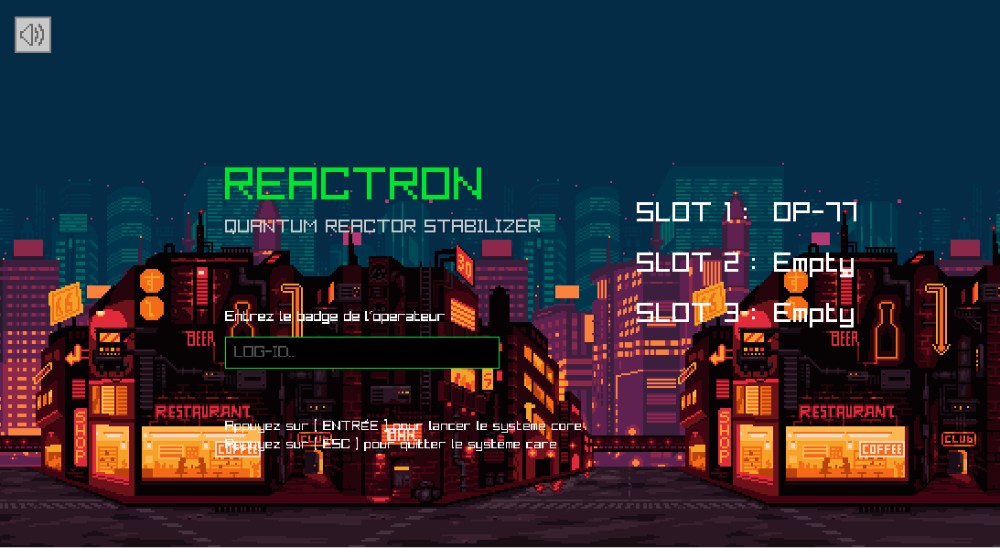

<div align="center">
  <a href="https://github.com/BlopRoy/ReactronProjetECEPREPAC2026">
    
  </a>

  <h3 align="center">Reactron</h3>

  <p align="center">
    Projet Prepac - Promo 2026
  </p>
</div>

<details>
  <summary>Sommaire</summary>
  <ol>
    <li>
      <a href="#a-propos-du-projet">A Propos Du Projet</a>
      <ul>
        <li><a href="#construit-avec">Construit Avec</a></li>
      </ul>
    </li>
    <li>
      <a href="#prérequis">Prérequis</a>
    </li>
    <li><a href="#installation">Installation</a></li>
    <li><a href="#compilation-et-lancement">Compilation et lancement</a></li>
    <li><a href="#documentation">Documentation</a></li>
    <li><a href="#sauvegarde">Sauvegarde</a></li>
  </ol>
</details>

## A Propos Du Projet



**Reactron** est un jeu de puzzle en 2D développé en C avec la bibliothèque [raylib](https://www.raylib.com/). Le joueur incarne un opérateur chargé de stabiliser le cœur d'un réacteur quantique en alignant des cellules d'énergie sur une grille 20×12.

Le jeu reprend les mécaniques d'un *match-3* classique (style Candy Crush / Bejeweled) :
- Échange de cellules adjacentes,
- Détection d'alignements horizontaux et verticaux de 3 cellules ou plus,
- Effets de cascade (gravité + remplissage automatique),
- Conditions de victoire et d'échec par niveau,
- Système de sauvegarde multi-profils.

#### Ce projet a été réalisé par :
- `BlopRoy`
- `Fotoen`
- `legenderylegend`
- `arthur-grhm`

<p align="right">(<a href="#readme-top">retour en haut</a>)</p>

### Construit Avec

* [](https://www.c-language.org/)
* [](https://www.raylib.com/)

<p align="right">(<a href="#readme-top">retour en haut</a>)</p>

<!-- Prerequis -->
## Prerequis

### MacOS

* HomeBrew

    ```
    /bin/bash -c "$(curl -fsSL https://raw.githubusercontent.com/Homebrew/install/HEAD/install.sh)"
    ```
* GCC
    
    ```
    brew install gcc
    ```
    
* cmake

    ```
    brew install cmake
    ```
### Linux

#### ARCH LINUX

* Cmake GCC

    ```
    sudo pacman -Syyu
    sudo pacman -Syy gcc cmake
    ```

### Windows

* MinGW
    
    ```
    winget install MartinStorsjo.LLVM-MinGW.MSVCRT
    ```

    ```
    gcc --version
    ```

* Cmake

    ```
    winget install Kitware.CMake
    ```

    ```
    cmake --version
    ```
<!-- Installation -->
## Installation

1. Clone le repo

    ```sh
    git clone https://github.com/BlopRoy/ReactronProjetECEPREPAC2026.git
    ```
<!-- Compilation et lancement -->
## Compilation et lancement

### Linux et MacOS

1. Compilation

    Ouvrez votre terminale et allez à la racine de votre projet.
    
    ```
    cmake -S . -B ./build
    ```

    ```
    cmake --build ./build
    ```

2. Lancement
    
    ```
    ./build/bin/PROJET
    ```

### Windows

1. Compilation

    Ouvrez votre terminale et allez à la racine de votre projet.
    
    ```
    cmake -S . -B .\build -G "MinGW Makefiles"
    ```

    ```
    cmake --build .\build
    ```

2. Lancement
    
    ```
    .\build\bin\PROJET.exe
    ```

<p align="right">(<a href="#readme-top">retourner en haut</a>)</p>


<!-- Documentation -->
## Documentation


#### Règles

- **Échange** : sélectionner deux cellules adjacentes (distance de Manhattan = 1) avec `ESPACE`. L'échange n'est valide que s'il produit un alignement.
- **Alignement** : 3 cellules identiques consécutives (horizontal ou vertical) → suppression et incrémentation du compteur d'énergie du niveau.
- **Bombe globale** : un alignement de **5 cellules ou plus** du même type détruit **toutes** les cellules de ce type présentes sur la grille.
- **Cascade** : après chaque suppression, la gravité fait tomber les cellules restantes et de nouvelles cellules remplissent le haut de la grille. Le processus se répète jusqu'à ce qu'aucun alignement ne subsiste.

#### Conditions de victoire / défaite

- **Victoire** : atteindre les objectifs d'énergie du niveau avant d'épuiser les coups et le temps imparti.
- **Défaite** : dépasser la limite de coups (`max_moves`) ou le temps limite (`time_limit`) → **surcharge +1**.
- **Game Over définitif** : 5 surcharges cumulées → écran d'instabilité critique (`STATE_CLEAR`).

---

#### Niveaux

| Niveau | Objectifs d'énergie | Coups max | Temps limite |
|--------|---------------------|-----------|--------------|
| 1      | 15R + 15B           | 30        | 180 s (3 min)|
| 2      | 20R + 20G + 15Y     | 25        | 150 s        |
| 3      | 25R+25B+25G+25Y+20V | 35        | 120 s        |

---

#### Contrôles

| Touche        | Action                                  |
|---------------|-----------------------------------------|
| `↑ ↓ ← →`    | Déplacer le curseur dans la grille      |
| `ESPACE`      | Sélectionner / échanger des cellules    |
| `ENTRÉE`      | Valider le menu / passer au niveau suivant (victoire) |
| `R`           | Relancer le niveau après un échec       |
| `N`           | Passer au niveau suivant (après victoire) |
| Bouton Maison     | Retourner au menu principal             |
| Bouton Audio     | Mettre la musique en pause / reprendre  |

---

#### Structure du projet

```
ReactronProjetECEPREPAC2026/
├── src/
│   ├── main.c                   # Boucle de jeu principale (états, entrées, dessin)
│   ├── gestion_matrice.c        # Initialisation, échange, gravité, remplissage de la grille
│   ├── detection_alignements.c  # Détection des alignements, suppression, effet bombe
│   ├── gestion_niveaux.c        # Configuration des niveaux, conditions de victoire/défaite
│   ├── rendering.c              # Rendu graphique (grille, interface, écrans spéciaux)
│   ├── sauvegarde.c             # Lecture/écriture du fichier save.txt (3 profils)
│   └── teste.c                  # Fonctions de test/debug
├── libs/
│   ├── type.h                   # Structures de données (GameContext, LevelConfig, GameSave…)
│   ├── gestion_matrice.h
│   ├── detection_alignements.h
│   ├── gestion_niveaux.h
│   ├── rendering.h
│   ├── sauvegarde.h
│   ├── raygui.h                 # Bibliothèque GUI (header-only)
│   └── raylib/                  # Source de raylib (sous-module)
├── assets/
│   ├── cyberpunk_street_background.png
│   ├── cyberpunk_street_midground.png
│   ├── cyberpunk_street_foreground.png  # Arrière-plan parallaxe en 3 couches
│   ├── match.mp3                # Son de correspondance
│   └── bgm_old.mp3              # Musique de fond
├── build/                       # Répertoire de compilation CMake (généré)
├── save.txt                     # Fichier de sauvegarde (3 profils joueurs)
└── CMakeLists.txt               # Configuration de compilation
```

---
### Sauvegarde

La progression est enregistrée dans `save.txt` (à la racine du binaire) au format :

```
Name1:<pseudo> Level1:<niveau> Surcharge1:<surcharge>
Name2:<pseudo> Level2:<niveau> Surcharge2:<surcharge>
Name3:<pseudo> Level3:<niveau> Surcharge3:<surcharge>
```

Le jeu gère **3 profils** simultanément. La sauvegarde est automatique à la victoire, à l'échec et au retour au menu.

---

<p align="right">(<a href="#readme-top">retour en haut</a>)</p>
